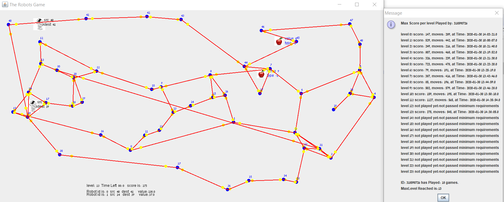

# The-Maze-of-Waze-Ex4

This project represents game of robut on a directional weighted graph, it's has a road-system in mind.

goal: to collect as many fruits as possible.

you can play the game automatic or Manuel.

# Automatic
the user choose the level, and the algorithm decides where to put each robot and which path to follow to get the optimal result.

# Manuel
the user choose the level and the user choose where to put the robot on the graph. after all set in the graph the user start to play and by click with the mouse on vertex (must be neighboor of the src) he make the robot go. on the end of the game the user get the final points.

